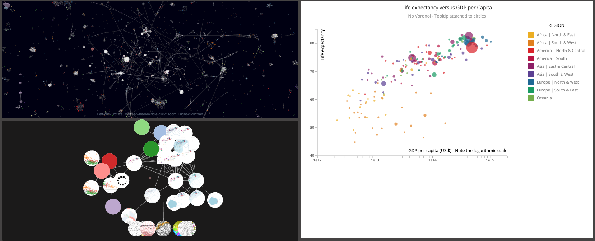

# d3-blocks-dashboard

A prototype dashboard for exploring relationships between the tens of thousands of [d3](https://d3js.org) examples or "blocks" produced by the d3 community over the past decade or so.

To explore, first click twice a node or "star" in the 3D force graph on the top left "Context" panel. The local neighborhood subgraph of other d3 examples that either reference or are referenced by the d3 example that this node represents will appear in the bottom left "Focus" panel.  

Next, inspect the nodes in the "Focus" panel, and click one that looks interesting. The full visualization that corresponds with that node in the local subgraph will then be rendered in the "Detail" panel on the right. 

The charts shown in this prototype are iterations on the blocks:
- [blocks citation network with 3d-force-graph](https://bl.ocks.org/micahstubbs/bf770b9f5d76f539a1a7fe8df7e32448)
- [d3 example graph search - description query](https://bl.ocks.org/micahstubbs/876d8cfa60670254c938d75a984d4f71)

The block [Step 1 - Voronoi Scatterplot - Simple scatterplot with no Voronoi](http://bl.ocks.org/nbremer/d5ef6c58f85aba2da48b) from [@NadiehBremer](https://twitter.com/NadiehBremer) is shown in the Detail panel on the right as the currently selected block.

Try the live dashboard at [d3.micah.fyi/08-dashboard-with-detail-view/](http://d3.micah.fyi/08-dashboard-with-detail-view/)
