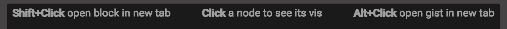
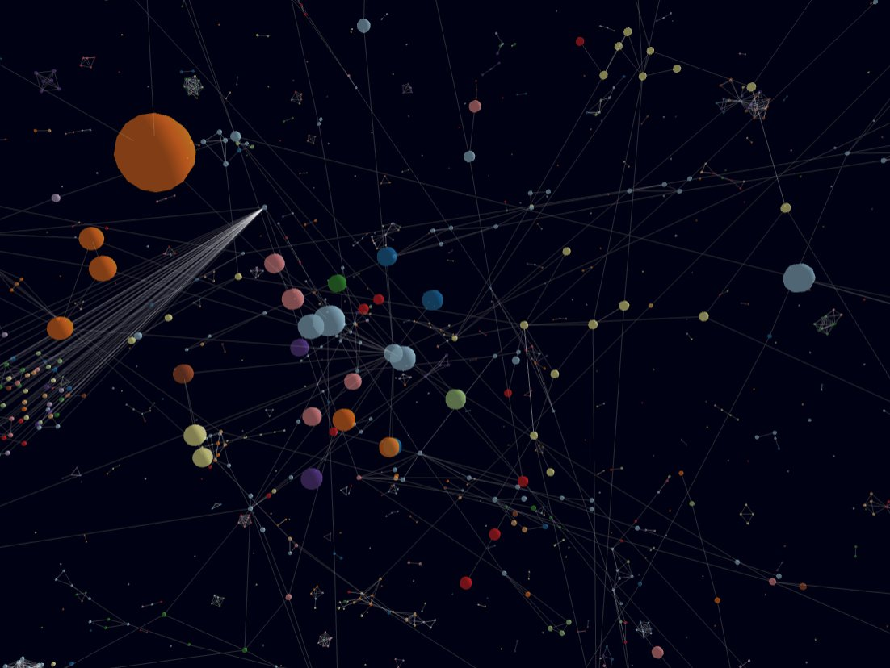

## User Feedback

### User A

Consider adding an inset locator map (mini-map) for the context 3D network view.

How does a minimap work in 3D outer space?

The problem with networks, especially 3D networks, is losing your sense of anchor/reference.

What can we do to ameliorate this problem?

Perhaps add some objects in the corners of the view?
Three different colored cubes, red, green, and blue, one in each of three corners?

Text rendering for context keyboard shortcut hints is strange.

Consider rendering context 3D network view as cubes or some shape other than spheres,
since "spheres render weird".

"I want the whole thing to be the galaxy view, and a modal to pop up and give a preview."

Alternately, "maybe when you click on a node, the galaxy view transforms into the thing
on the lower left [the focus 2D network view]?"

Proposed user flow:

1. galaxy view full screen
2. click on node
3. irrelevant nodes disappear as relevant nodes flatten into 2D network on leftside of screen, rightside preview of clicked node
4. click 2D network to explore local subgraph neigbhorhood nodes
5. find insight, then exit and return to galaxy

### User B

How best to optimize for mobile?

### User C

One thing that happens sometimes is that I lose the elements around the block:

Maybe the block just has nothing around it? No title or anything?

### User D

If the 3D network layout does not depend entirely on the data source, maybe you can start with a bit of precalculated 3D layout to skip the initial ticks.

A little text search would be nice.
